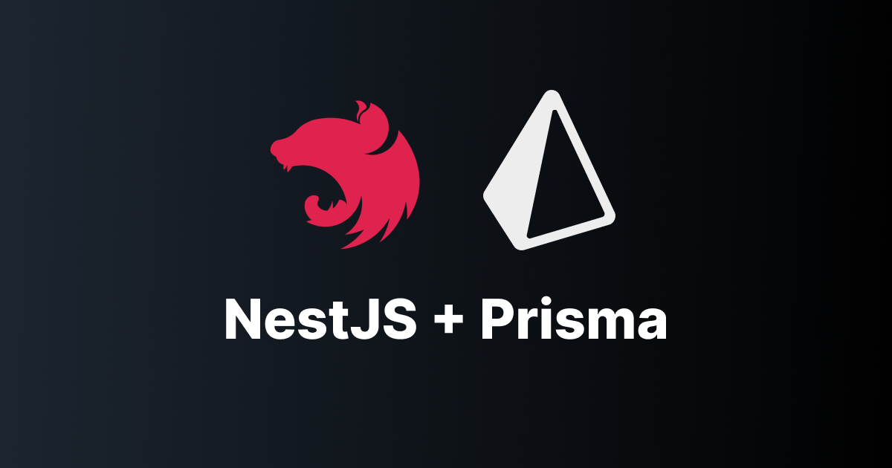

# Projeto Default de Autenticação de usuário com NestJS e PrismaORM

Este é um projeto default de autenticação desenvolvido com o NestJS e o PrismaORM. Ele fornece uma estrutura sólida para a criação de aplicativos web e APIs seguras com autenticação de usuário.

## Recursos Principais

- **NestJS**: O [NestJS](https://docs.nestjs.com/first-steps)  é um framework Node.js altamente modular que oferece uma arquitetura escalável e pronta para produção. Ele é perfeito para criar aplicativos RESTful, GraphQL e WebSocket.

- **PrismaORM**: O [PrismaORM](https://www.prisma.io/docs/getting-started/quickstart) é uma ferramenta de mapeamento objeto-relacional (ORM) moderna e poderosa para Node.js e TypeScript. Ele simplifica a interação com bancos de dados SQL, permitindo que você escreva consultas de forma segura e eficiente.

- **Autenticação JWT**: Utiliza JSON Web Tokens (JWT) para autenticar os usuários de forma segura, fornecendo tokens de acesso para autorização.

- **Criptografia de Senha com bcrypt**: As senhas dos usuários são criptografadas usando a biblioteca `bcrypt` para garantir a segurança das informações confidenciais.

- **Validação de Dados**: Usa as bibliotecas `class-validator` e `class-transformer` para validar e transformar dados de entrada.

**Observação:** O schema do Prisma está configurado para usar o banco de dados PostgreSQL por padrão. No entanto, você pode facilmente alterar essa configuração para usar outro banco de dados de sua escolha, conforme necessário. Basta ajustar as configurações no arquivo `schema.prisma` para refletir a sua escolha de banco de dados.

## Uso

Este projeto default pode servir como uma base sólida para criar sua própria aplicação com autenticação. Você pode personalizá-lo de acordo com suas necessidades adicionando rotas, modelos de dados e lógica de negócios.

## Contribuição

Contribuições são bem-vindas! Sinta-se à vontade para abrir problemas (issues) e enviar solicitações de pull (pull requests) para melhorar este projeto.

## Instalação
Antes de começar a usar este projeto, siga as etapas de instalação descritas abaixo para configurar o ambiente e instalar as dependências necessárias.

### 1. Instale o CLI do NestJS

Certifique-se de que você tem o [NestJS CLI](https://docs.nestjs.com/first-steps) instalado globalmente.

```
npm i -g @nestjs/cli
```
### 2. Configure o arquivo `.env`

Crie um arquivo `.env` na raiz do seu projeto com as seguintes variáveis de ambiente:

```
DATABASE_URL="***********[SEU BANCO DE DADOS]***********"
JWT_SECRET="*********[CRIE UM JWT SECRET]**********"
```

### 3. Instale o Prisma

Execute os seguintes comandos para instalar e configurar o [Prisma](https://www.prisma.io/docs/getting-started/quickstart):
```
npm install --save @prisma/client
npx prisma generate
npx prisma migrate dev
```

### 4. Instale as Dependências
Instale as seguintes dependências necessárias para a autenticação:
```
npm i --save @nestjs/config
npm install --save @nestjs/jwt passport-jwt
npm install --save-dev @types/passport-jwt
npm i bcrypt
npm i -D @types/bcrypt
npm install --save @nestjs/passport passport passport-local
npm install --save-dev @types/passport-local
npm i --save class-validator class-transformer
```

## Como Rodar o Projeto

Para rodar o projeto, execute o seguinte comando:

```
npm run start:dev
```
Isso iniciará o servidor do NestJS e tornará sua aplicação acessível no seu navegador em http://localhost:3000/

Certifique-se de ter todas as dependências instaladas e a configuração adequada antes de iniciar o projeto.

### Contato
Se você tiver alguma dúvida, sugestão ou precisar de assistência, sinta-se à vontade para entrar em contato comigo.

- [Linkedin](https://www.linkedin.com/in/allan-batista-dev/)